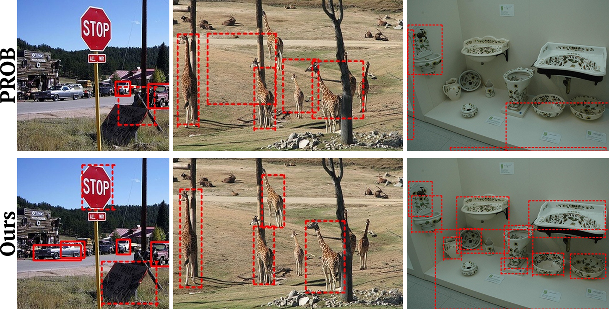
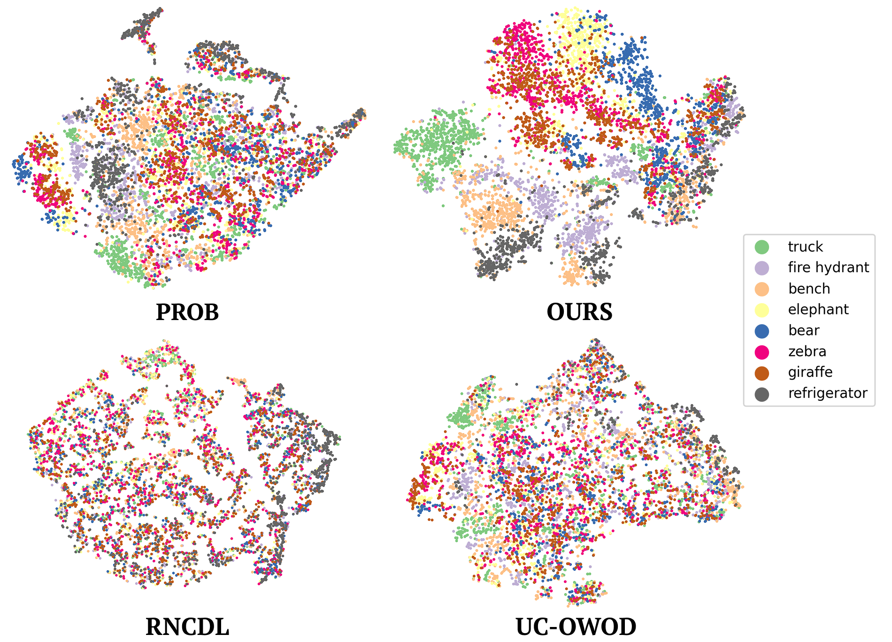

# OW-Rep

The code will be uploaded soon.
If you have any question, please contact me via email at [sunoh0131@gmail.com](mailto:sunoh0131@gmail.com).


<p align="center">

</p>

*Open-World Object Detection method enhanced by Vision Foundation Models for better detection performance and effective feature similarity recognition among detected instances.*

#### Sunoh Lee, Minsik Jeon, Jihong Min, Junwon Seo

> Open World Object Detection (OWOD) addresses realistic scenarios where unseen object classes emerge, enabling detectors trained on known classes to detect unknown objects and incrementally incorporate the knowledge they provide. While existing OWOD methods primarily focus on detecting unknown objects, they often overlook the rich semantic relationships between detected objects, which are essential for scene understanding and applications in open-world environments (e.g., open-world tracking and novel class discovery). In this paper, we extend the OWOD framework to jointly detect unknown objects and learn semantically rich instance embeddings, enabling the detector to capture fine-grained semantic relationships between instances. To this end, we propose two modules that leverage the rich and generalizable knowledge of Vision Foundation Models (VFM). First, the Unknown Box Refine Module uses instance masks from the Segment Anything Model to accurately localize unknown objects. The Embedding Transfer Module then distills instance-wise semantic similarities from VFM features to the detector’s embeddings via a relaxed contrastive loss, enabling the detector to learn a semantically meaningful and generalizable instance feature. Extensive experiments show that our method significantly improves both unknown object detection and instance embedding quality, while also enhancing performance in downstream tasks such as open-world tracking.

<a href="https://arxiv.org/abs/2409.16073"></a>
<a href="https://sunohlee.github.io/"></a> 


## 🔥 NEWS

**`2025/11/11`**: 🚀 OW-Rep was accepted to **WACV 2026**


## Table of Contents
- [Results](#Results)
- [Installation](#installation)
- [Train](#Train)
- [Inference](#Inference)
- [Citation](#citation)


## Results
Here are some example outputs:

<p align="center">
  
<br>
<p align="center">
  
<br>
<p align="center">
  
<br>
<p align="center">
  
<br>


## Installation

### Step 0 - Docker Image Pull
```

```


## Train

A detailed script will be published!

```

```

## Inference

A detailed script will be published!

```

```


## Citation
If you find this code useful for your research, please consider citing us:

```
@article{lee2024open,
  title={Open-World Object Detection with Instance Representation Learning},
  author={Lee, Sunoh and Jeon, Minsik and Min, Jihong and Seo, Junwon},
  journal={arXiv e-prints},
  pages={arXiv--2409},
  year={2024}
}
```
