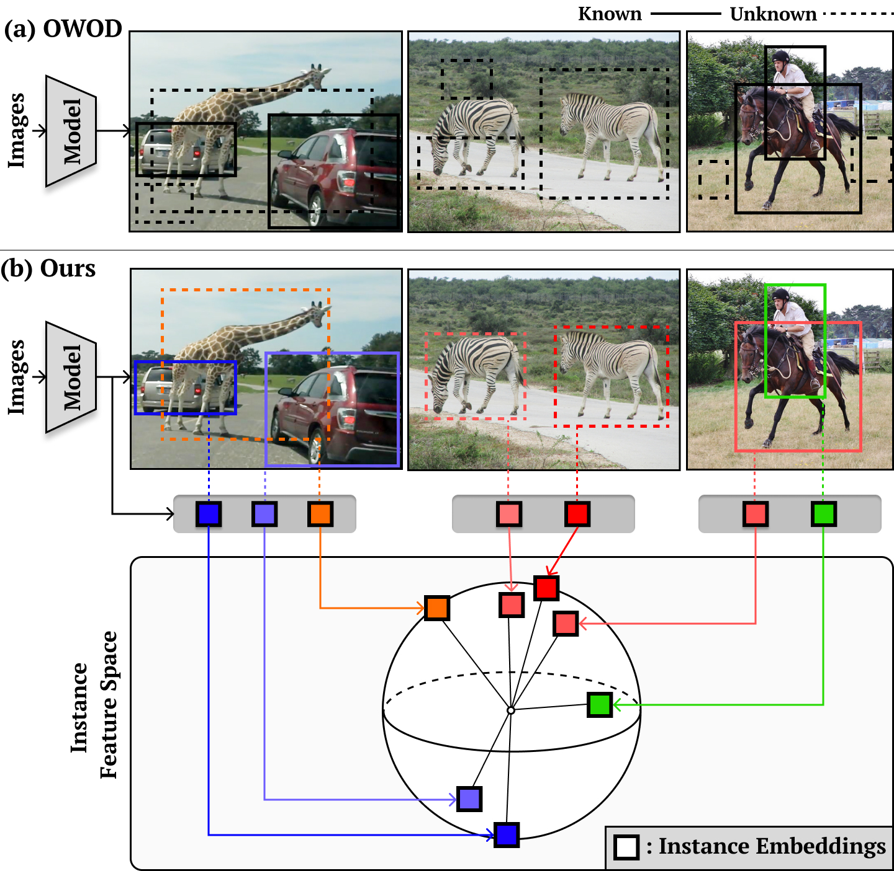
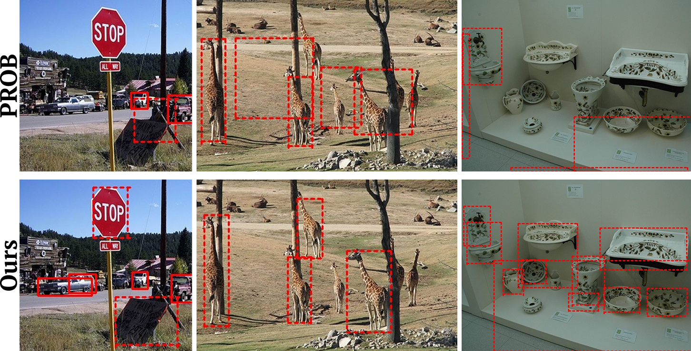
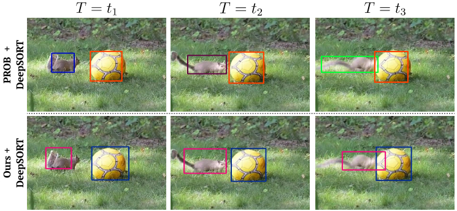
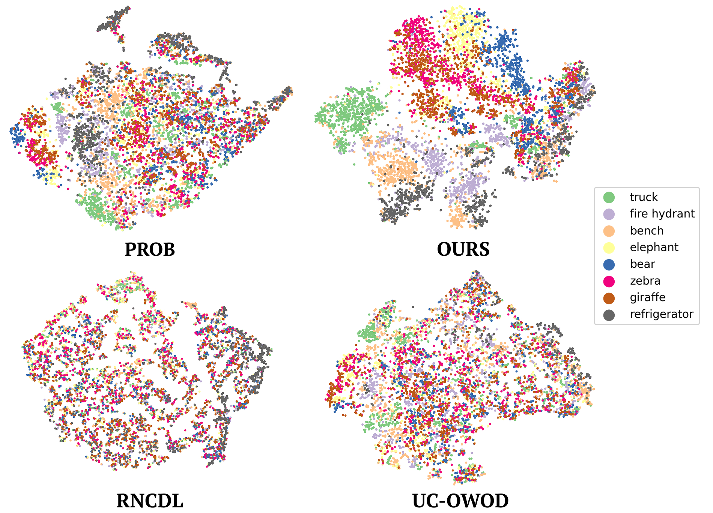

# OW-Rep

If you have any question (code sharing, weight, data split etc), please feel free to contact me via email at [sunoh0131@gmail.com](mailto:sunoh0131@gmail.com).


<p align="center">

</p>

*Open-World Object Detection method enhanced by Vision Foundation Models for better detection performance and effective feature similarity recognition among detected instances.*

#### Sunoh Lee, Minsik Jeon, Jihong Min, Junwon Seo

> Open World Object Detection (OWOD) addresses realistic scenarios where unseen object classes emerge, enabling detectors trained on known classes to detect unknown objects and incrementally incorporate the knowledge they provide. While existing OWOD methods primarily focus on detecting unknown objects, they often overlook the rich semantic relationships between detected objects, which are essential for scene understanding and applications in open-world environments (e.g., open-world tracking and novel class discovery). In this paper, we extend the OWOD framework to jointly detect unknown objects and learn semantically rich instance embeddings, enabling the detector to capture fine-grained semantic relationships between instances. To this end, we propose two modules that leverage the rich and generalizable knowledge of Vision Foundation Models (VFM). First, the Unknown Box Refine Module uses instance masks from the Segment Anything Model to accurately localize unknown objects. The Embedding Transfer Module then distills instance-wise semantic similarities from VFM features to the detector’s embeddings via a relaxed contrastive loss, enabling the detector to learn a semantically meaningful and generalizable instance feature. Extensive experiments show that our method significantly improves both unknown object detection and instance embedding quality, while also enhancing performance in downstream tasks such as open-world tracking.

<a href="https://arxiv.org/abs/2409.16073"></a>
<a href="https://sunohlee.github.io/OW-Rep"></a> 


## 🔥 NEWS

**`2025/11/11`**: 🚀 OW-Rep was accepted to **WACV 2026**


## Table of Contents
- [Results](#Results)
- [Preparation](#Preparation)
- [Train](#Train)
- [Inference](#Inference)
- [Citation](#citation)


## Results
Here are some example outputs:

<p align="center">
  
<br>
<p align="center">
  
<br>
<p align="center">
  
<br>
<p align="center">
  
<br>


## Preparation

### Step 1 - Environment Setup
**Option A: Using Docker (Recommended)**
You can easily set up the environment by pulling the pre-built Docker image:
```
docker pull sunoh0131/ow-rep:latest
```

Note: Alternatively, you can manually install the environment by following the "Requirements and Installation" guide in the <a href="https://github.com/orrzohar/PROB?tab=readme-ov-file">PROB GitHub repository</a>.

### Step 2 - Dataset
You can download [coco dataset](https://cocodataset.org/#download) and [pascal dataset](http://host.robots.ox.ac.uk/pascal/VOC/) into the `data/` directory.

You can refer to "Dataset Preparation" part in the <a href="https://github.com/orrzohar/PROB?tab=readme-ov-file">PROB GitHub repository</a>.

Previous and our dataset splits are in the `data/OWOD/ImageSets` directory.

Dataset folder structure:
```
workspace/
└── data/
    └── OWOD/
        ├── JPEGImages
        ├── Annotations
        └── ImageSets
            ├── OWDETR
            ├── TOWOD
            └── VOC2007
```

### Step 3 - Dinov2, SAM Feature (only for training)
<!-- - Run the following scripts to generate the features:
```
python dino_feat_gen.py
python sam_feat_gen.py
```

- If transformer version miss match appears, you might upgrade the transformer version :
 ```
 install --no-cache-dir transformers==4.37.0
``` -->


### Step 4 - Pretrained Weight
#### Backbone model weight
You can download the self-supervised backbone model from [here](https://dl.fbaipublicfiles.com/dino/dino_resnet50_pretrain/dino_resnet50_pretrain.pth) and place the .pth file inside the `models/` directory.

#### Our model weights

<!-- Note: The pre-trained weights are hosted on Google Drive. Please request access via the links below, and I will approve it.
(If you want other model weights with other splits or models, please ask me.)

| Model Type        | Download Link |
|---|---|
| PROB base	        | <a href="https://drive.google.com/drive/folders/1cadaraR0sajsWl4m8qz92WF3Un0mBbjF?usp=drive_link">Google drive link</a> |
| Ours (PROB + SAM)	| <a href="https://drive.google.com/drive/folders/1_RA2ZgcplV4ifLT6Ln8ZxR3wAfWARfqq?usp=drive_link">Google drive link</a> |
| Ours (PROB + ET)	| <a href="https://drive.google.com/drive/folders/1tWQF6XDojrvV0rIoUQB1_uM4PLGUwNl5?usp=drive_link">Google drive link</a> |
| Ours (PROB + Both)| <a href="https://drive.google.com/drive/folders/1pLn33wcMK85-HuzuiOSwKV8K2Aagie45?usp=drive_link">Google drive link</a> | -->


## Train
<!-- All details are in run_daidc_prob.sh -->
- Tested in A100 80GB
<!-- - **Note**: If you encounter Out-Of-Memory (OOM) errors during training, uncomment line 116 in engine.py and adjust the frequency of empty_cache(). -->

### Example

<!-- ```
CUDA_GPUS_PER_NODE=4 ./tools/run_dist_launch.sh 4 configs/incremental/M_OWOD_BENCHMARK_2025_ETLR_SAMREF.sh
``` -->

## Inference

<!-- - All details are in run_daidc_prob.sh -->
- For inference, SAM and DINO features or their models are not required.

<!-- - The original test set contains duplicate file names, which causes some images to be evaluated multiple times. To solve this, please use ./data/OWOD/ImageSets/TOWOD/owod_all_task_test.txt and run the evaluation code with 2 or fewer GPUs. (This is simply a reordered version of the original owod_all_task_test.txt. If you evaluate with a single GPU, you can use either text file.)

- For instance, in M_PROB_ET_SAM_eval.sh, change `FOLDER_NAME` to the directory where the pretrained weights are located. Also, make sure the weights are placed in the correct hierarchy to match the `--resume` path. -->

### Example
<!-- 
```
CUDA_GPUS_PER_NODE=2 ./tools/run_dist_launch.sh 2 configs/incremental/M_PROB_ET_SAM_eval.sh
``` -->


## Citation
If you find this code useful for your research, please consider citing us:

```
@inproceedings{lee2026ow,
  title={OW-Rep: Open World Object Detection with Instance Representation Learning},
  author={Lee, Sunoh and Jeon, Minsik and Min, Jihong and Seo, Junwon},
  booktitle={Proceedings of the IEEE/CVF Winter Conference on Applications of Computer Vision (WACV)},
  pages={339--349},
  year={2026}
}
```

## Contact
If you have any question, please contact me via email at [sunoh0131@gmail.com](mailto:sunoh0131@gmail.com).


## Acknowledgements
OW-Rep builds on previous works' code bases such as [PROB](https://github.com/orrzohar/PROB?tab=readme-ov-file), [Deformable DETR](https://github.com/fundamentalvision/Deformable-DETR), [Detreg](https://github.com/amirbar/DETReg), [LabelRelaxation](https://github.com/sung-yeon-kim/LabelRelaxation-CVPR21) and [OWOD](https://github.com/JosephKJ/OWOD). If you found OW-Rep useful please consider citing these works as well.
